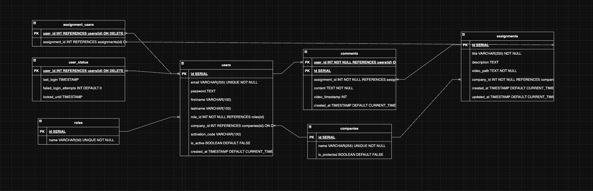
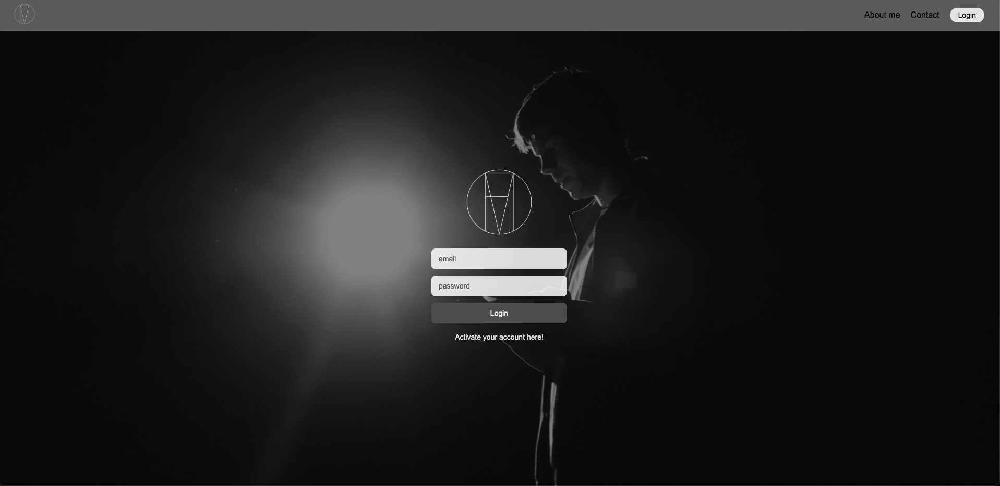
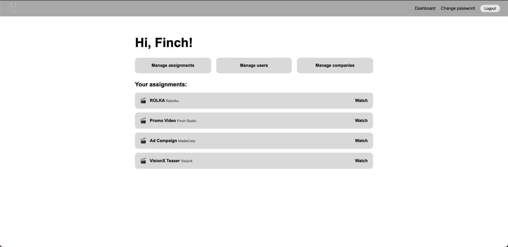
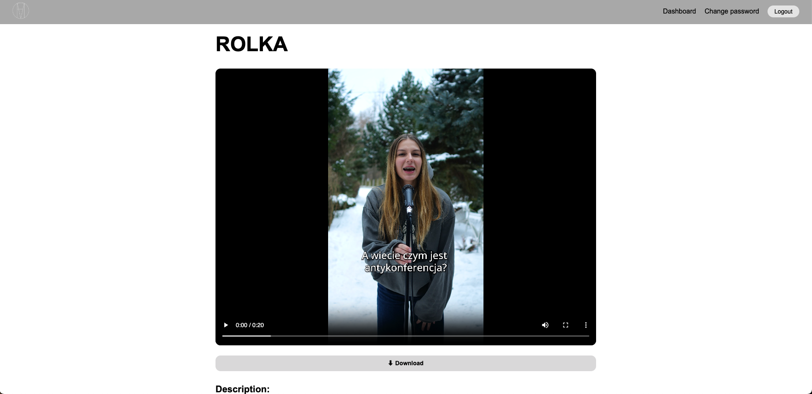
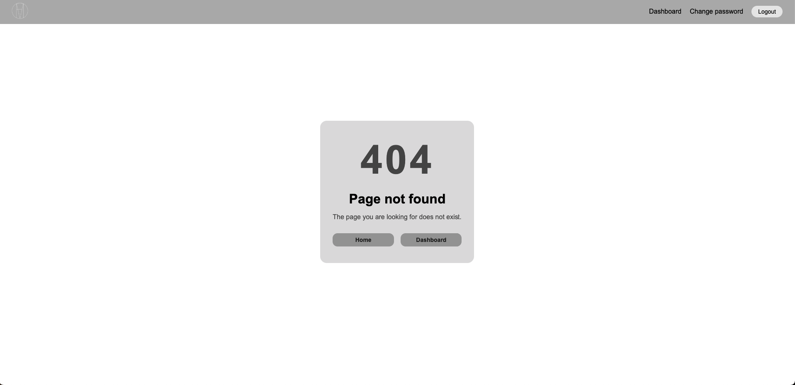
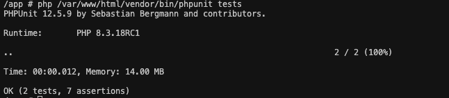
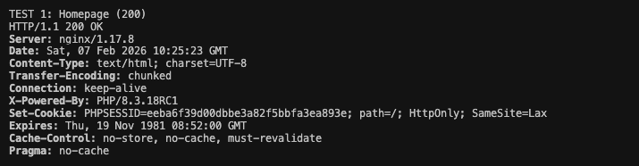

# Projekt WDPaI 2025 - FINCH MEDIA

## 1. Diagram ERD bazy danych

Diagram ERD przedstawiający strukturę bazy danych oraz relacje pomiędzy tabelami znajduje się w repozytorium:



Baza danych zawiera wszystkie typy relacji:

* jeden-do-jednego (`users` ↔ `user_status`)
* jeden-do-wielu (`companies` → `users`, `assignments`)
* wiele-do-wielu (`assignments` ↔ `users`)


## 2. Screeny aplikacji

### Home


### Login


### Dashboard


### Assignment


### 404



## 3. Architektura aplikacji (diagram warstwowy)

Aplikacja została zaprojektowana w architekturze **MVC (Model–View–Controller)**.

```text
Frontend (HTML / CSS / JS)
        ↓
Routing (Routing.php)
        ↓
Controllers
        ↓
Repositories (Model)
        ↓
PostgreSQL Database
```

Kontrolery odpowiadają za logikę aplikacji, walidację danych i autoryzację,
repozytoria realizują komunikację z bazą danych.

## 4. Instrukcja uruchomienia projektu

### Wymagania

* Docker
* Docker Compose

### Uruchomienie

```bash
docker-compose up --build
```

Aplikacja dostępna pod adresem:

```
http://localhost:8080
```

## 5. Zmienne środowiskowe

Przykładowe zmienne środowiskowe znajdują się w pliku:

```
.env.example
```

Zawierają konfigurację połączenia z bazą danych oraz ustawienia aplikacji.

## 6. Scenariusz testowy (krok po kroku)

### Logowanie i role

1. Zaloguj się jako użytkownik z rolą USER
   → dostęp tylko do własnych zleceń
2. Zaloguj się jako MODERATOR
   → dostęp do wszystkich zleceń
3. Zaloguj się jako ADMIN
   → pełny dostęp do systemu

### CRUD

* utworzenie użytkownika,
* edycja danych użytkownika,
* usunięcie użytkownika,
* utworzenie i edycja zlecenia,
* dodawanie, edycja i usuwanie komentarzy.

### Obsługa błędów

* wejście na nieistniejącą trasę → **404**
* próba dostępu bez uprawnień → **403**
* błędne żądanie (np. brak ID) → **400**
* nieoczekiwany błąd serwera (np. wyjątek bazy danych) → **500 (Internal Server Error)**

### Widoki / funkcje / wyzwalacze

* sprawdzenie widoków SQL (`assignment_comment_count`, `user_assignment_count`)
* sprawdzenie funkcji `get_assignment_comments`
* dodanie komentarza → aktualizacja `updated_at` przez trigger

## 7. Testy

- **UserRepositoryTest** - Sprawdza poprawność operacji na użytkownikach, w szczególności:
  - pobieranie użytkownika na podstawie adresu e-mail,
  - poprawne mapowanie danych zwracanych z bazy,
  - obsługę sytuacji, w której użytkownik nie istnieje.

- **CompanyRepositoryTest** - Weryfikuje poprawność operacji związanych z firmami:
  - pobieranie listy firm,
  - tworzenie nowych rekordów,
  - obsługę unikalności nazw firm.

#### Wynik:


### Testy integracyjne

* skrypt `tests/integration.sh` (curl)

Skrypt testuje następujące scenariusze:

- dostęp do strony głównej aplikacji (**200 OK**),
- dostęp do strony logowania (**200 OK**),
- wejście na nieistniejącą trasę (**404 Not Found**),
- próba dostępu do zasobu chronionego bez autoryzacji (ochrona zasobów / przekierowanie do logowania).

#### Wynik (przykładowy):


## 8. Checklista

* [x] Docker + docker-compose
* [x] PHP obiektowy, brak frameworków
* [x] Architektura MVC
* [x] PostgreSQL
* [x] Wszystkie typy relacji w DB
* [x] Widoki, funkcja i wyzwalacz SQL
* [x] Transakcje
* [x] Role i autoryzacja
* [x] Sesje i CSRF
* [x] Globalna obsługa błędów 400/403/404/500
* [x] Testy jednostkowe i integracyjne
* [x] Dokumentacja w README.md

